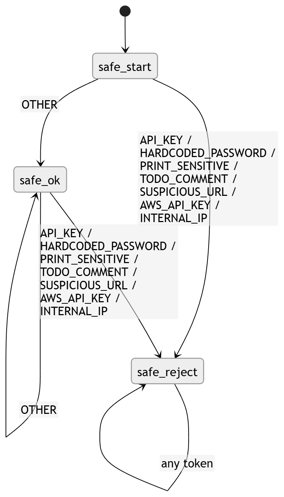
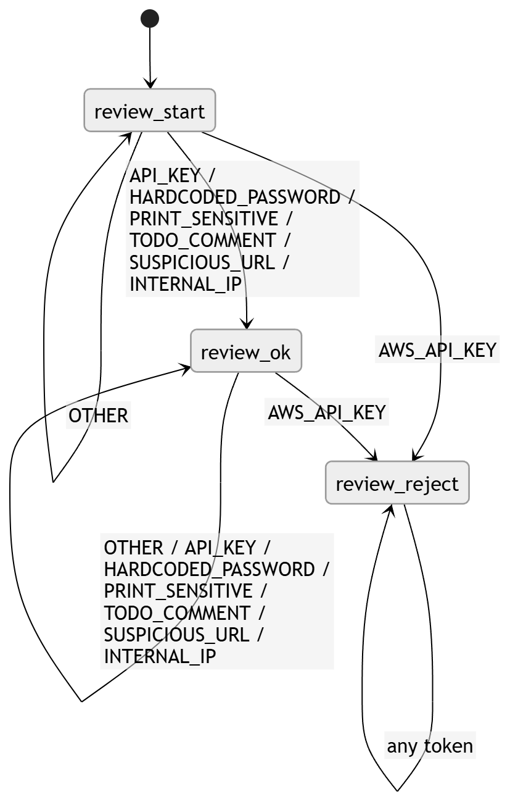
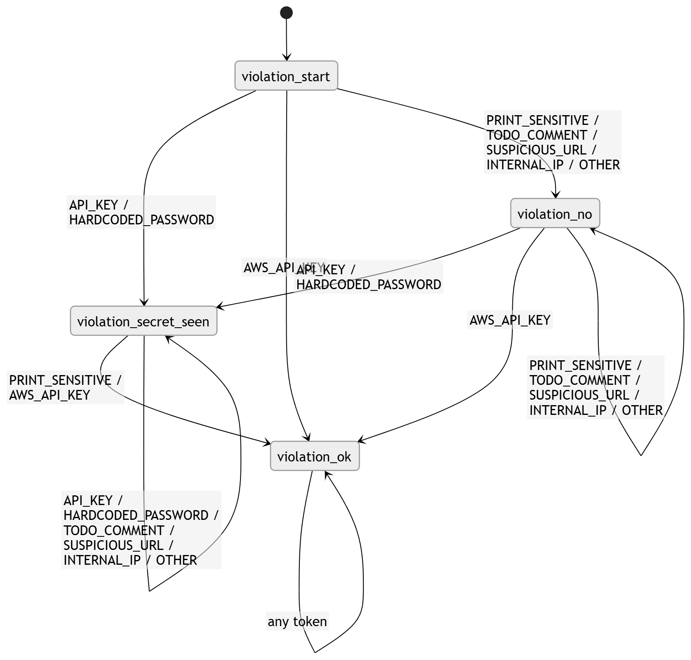

# 2. Classification with deterministic finite automata (DFA)

## Intuition

We already have a **token sequence** (not raw text). We want to put the file into one of three buckets:

- **Safe** — no strong risk signals.  
- **Needs Review** — something looks off, but we do not hit the worst combination.  
- **Security Violation** — for example secret plus print, or certain tokens the assignment treats as a direct violation.

Each bucket is modeled with a separate **DFA** in `pyformlang`; the program then picks which description applies according to the rules we coded.

---

## Token alphabet

Σ = {
 `API_KEY`, `HARDCODED_PASSWORD`, `PRINT_SENSITIVE`,
 `TODO_COMMENT`, `SUSPICIOUS_URL`, `AWS_API_KEY`,
 `INTERNAL_IP`, `OTHER`
}

---

## DFA 1: “Is it really safe?”

**Type:** DFA (deterministic).

**5-tuple (short):**

- Q = {`safe_start`, `safe_ok`, `safe_reject`}  
- Σ = {
  `API_KEY`, `HARDCODED_PASSWORD`, `PRINT_SENSITIVE`,
  `TODO_COMMENT`, `SUSPICIOUS_URL`, `AWS_API_KEY`,
  `INTERNAL_IP`, `OTHER`
  }
- q₀ = `safe_start`  
- F = {`safe_ok`}

**δ in words:** from the start, if you only ever see `OTHER` you reach “ok”. The moment any “hot” token appears you drop into reject and stay there. One stain and it is not safe.
### Transition Table  

| δ           | OTHER       | API_KEY     | HARDCODED_PASSWORD | PRINT_SENSITIVE | TODO_COMMENT | SUSPICIOUS_URL | AWS_API_KEY | INTERNAL_IP |
| ----------- | ----------- | ----------- | ------------------ | --------------- | ------------ | -------------- | ----------- | ----------- |
| safe_start  | safe_ok     | safe_reject | safe_reject        | safe_reject     | safe_reject  | safe_reject    | safe_reject | safe_reject |
| safe_ok     | safe_ok     | safe_reject | safe_reject        | safe_reject     | safe_reject  | safe_reject    | safe_reject | safe_reject |
| safe_reject | safe_reject | safe_reject | safe_reject        | safe_reject     | safe_reject  | safe_reject    | safe_reject | safe_reject |

---
### Diagram

 
---

## Example

Accepted:

```text
OTHER, OTHER
```

Rejected:

```text
TODO_COMMENT
```

Rejected:

```text
API_KEY
```
---
## DFA 2: “Should review this?”

+ Q = {`review_start`, `review_ok`, `review_reject`}
+ Σ = The language above 
+ q₀ = `review_start`  
+ F = {`review_ok`}  

**Idea:** accepts suspicious or incomplete situations **without** reaching the worst case captured by the third DFA (for example some print+secret combos, or AWS key depending on the rules).

**δ**:

* From `review_start`, reading `OTHER` keeps the automaton in `review_start`
* Reading any token in `R` moves to `review_ok`
* Reading `AWS_API_KEY` moves to `review_reject`
* From `review_ok`, reading any token in `R` or `OTHER` stays in `review_ok`
* Reading `AWS_API_KEY` moves to `review_reject`
* `review_reject` is a sink state
### Transition Table

| δ             | OTHER         | API_KEY       | HARDCODED_PASSWORD | PRINT_SENSITIVE | TODO_COMMENT  | SUSPICIOUS_URL | INTERNAL_IP   | AWS_API_KEY   |
| ------------- | ------------- | ------------- | ------------------ | --------------- | ------------- | -------------- | ------------- | ------------- |
| review_start  | review_start  | review_ok     | review_ok          | review_ok       | review_ok     | review_ok      | review_ok     | review_reject |
| review_ok     | review_ok     | review_ok     | review_ok          | review_ok       | review_ok     | review_ok      | review_ok     | review_reject |
| review_reject | review_reject | review_reject | review_reject      | review_reject   | review_reject | review_reject  | review_reject | review_reject |

---
### Diagram


---
## Additional policy restrictions

Although the DFA above captures the basic "review" language, the implementation also applies additional semantic rules:

* If `AWS_API_KEY` appears, the file is **not** classified as Needs Review
* If `HARDCODED_PASSWORD` and `PRINT_SENSITIVE` both appear, the file is **not** classified as Needs Review
* If `API_KEY` and `PRINT_SENSITIVE` both appear, the file is **not** classified as Needs Review
---

## Example

Accepted:

```text
TODO_COMMENT
```

Accepted:

```text
API_KEY
```

Accepted:

```text
SUSPICIOUS_URL, INTERNAL_IP
```

Rejected:

```text
AWS_API_KEY
```

Rejected by additional rule:

```text
HARDCODED_PASSWORD, PRINT_SENSITIVE
```
---

## DFA 3: “Is this already a violation?”

+ Q = {
  `violation_start`,
  `violation_secret_seen`,
  `violation_ok`,
  `violation_no`
}
+ Σ = The language above 
+ q₀ = `violation_start`  
+ F = {`violation_ok`}  

**Transitions that matter (high level):**

- Password / API key → “secret seen” state.  
- Sensitive print after that → violation.  
- `AWS_API_KEY` can jump straight to violation depending on the design.
---
**δ**:

* From the start state:

  * `API_KEY` or `HARDCODED_PASSWORD` means a secret has been seen
  * `AWS_API_KEY` is an immediate violation
  * other symbols go to a neutral non-violation state

* From `violation_secret_seen`:

  * `PRINT_SENSITIVE` confirms the violation
  * `AWS_API_KEY` also confirms the violation
  * other tokens keep the memory that a secret has been seen

* From `violation_no`:

  * a later `API_KEY` or `HARDCODED_PASSWORD` moves to the secret-seen state
  * `AWS_API_KEY` jumps directly to violation
  * other symbols remain in the neutral state

* `violation_ok` is a sink accepting state

## Transition table

| δ                     | API_KEY               | HARDCODED_PASSWORD    | PRINT_SENSITIVE | TODO_COMMENT          | SUSPICIOUS_URL        | INTERNAL_IP           | AWS_API_KEY  | OTHER                 |
| --------------------- | --------------------- | --------------------- | --------------- | --------------------- | --------------------- | --------------------- | ------------ | --------------------- |
| violation_start       | violation_secret_seen | violation_secret_seen | violation_no    | violation_no          | violation_no          | violation_no          | violation_ok | violation_no          |
| violation_secret_seen | violation_secret_seen | violation_secret_seen | violation_ok    | violation_secret_seen | violation_secret_seen | violation_secret_seen | violation_ok | violation_secret_seen |
| violation_no          | violation_secret_seen | violation_secret_seen | violation_no    | violation_no          | violation_no          | violation_no          | violation_ok | violation_no          |
| violation_ok          | violation_ok          | violation_ok          | violation_ok    | violation_ok          | violation_ok          | violation_ok          | violation_ok | violation_ok          |

---

## Transition diagram

## Easy example

Sequence: `HARDCODED_PASSWORD` → `PRINT_SENSITIVE`  
**Outcome:** **Security Violation** (classic story: stored the secret and printed it).

---

## Why a finite automaton is enough here

Tokens form a **finite alphabet** and the policies we encode use **finite memory** (“have I seen a secret?”, “am I in violation?”). We are not counting arbitrarily nested parentheses in this stage; that is what the configuration grammar is for.

So a DFA is reasonable. If the event language needed unbounded nesting with a stack, we would move up to a richer model.

---

