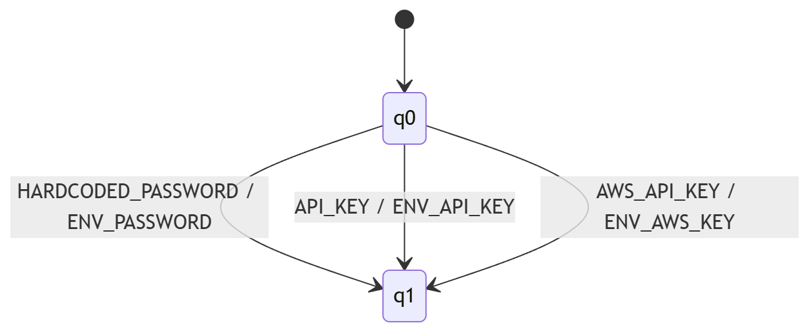
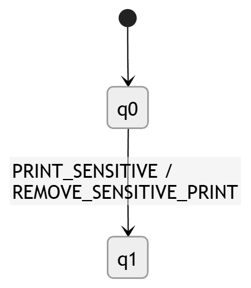
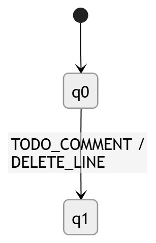
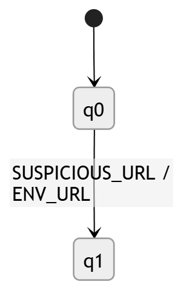
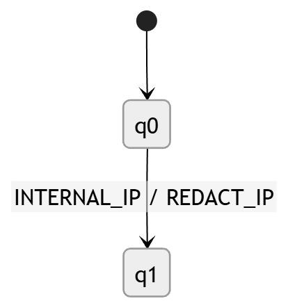

# 3. Automatic refactoring with finite-state transducers (FST)

## What this adds

An automaton **accepts or rejects** (or ends in some state). A **transducer** goes further: while reading tokens it also **emits actions** such as “replace this line” or “comment this out”. That is the “surgeon” part: we already know something is wrong, now we propose a patch.

---
## Objective

This module automatically transforms insecure code patterns into safer alternatives.

Unlike a DFA, which only recognizes whether an input belongs to a language, a finite-state transducer also **produces output** while reading the input. In this project, the input symbols are security tokens produced by the detector, and the output symbols are symbolic rewrite actions.

Examples:
- `HARDCODED_PASSWORD` → `ENV_PASSWORD`
- `PRINT_SENSITIVE` → `REMOVE_SENSITIVE_PRINT`
- `TODO_COMMENT` → `DELETE_LINE`

These actions are later converted into actual code edits.

---

## Type of transducer

The transducers used in this project are **deterministic finite-state transducers (FSTs)** over an abstract token alphabet.

They are deterministic because for each state and each input symbol there is at most one transition and one emitted output.

---

## General formal model

An FST can be written as:

T = (Q, Σ, Γ, δ, ω, q₀, F)

Where:

- **Q** = finite set of states
- **Σ** = input alphabet (security tokens).  
- **Γ** = output alphabet (rewrite actions).  
- **δ** = transition function
- **ω** = output function on transitions.
- **q₀** = initial state
- **F** = set of final states

In `pyformlang` we build FSTs and then map those actions to concrete Java / config lines.

---

## FST 1: secrets → environment variable
### Purpose

This transducer transforms secret-related tokens into actions that replace hardcoded values with environment variable references.

Examples:
- `HARDCODED_PASSWORD` → `ENV_PASSWORD`
- `API_KEY` → `ENV_API_KEY`
- `AWS_API_KEY` → `ENV_AWS_KEY`

Q = {q0, q1}  
Σ = {`HARDCODED_PASSWORD`, `API_KEY`, `AWS_API_KEY`}  
Γ = {`ENV_PASSWORD`, `ENV_API_KEY`, `ENV_AWS_KEY`}

q₀ = q₀

F = {q_1}

ω:
ω(q₀, HARDCODED_PASSWORD) = ENV_PASSWORD

ω(q₀, API_KEY) = ENV_API_KEY 

ω(q₀, AWS_API_KEY) = ENV_AWS_KEY

---

## Transition table δ

| Current state | Input | Next state | Output |
|---|---|---|---|
| q0 | HARDCODED_PASSWORD | q1 | ENV_PASSWORD |
| q0 | API_KEY | q1 | ENV_API_KEY |
| q0 | AWS_API_KEY | q1 | ENV_AWS_KEY |

---
### Transition diagram

---

## FST 2: remove dangerous prints

### Purpose

This transducer removes or comments out prints of sensitive values.

Example:

* `PRINT_SENSITIVE` → `REMOVE_SENSITIVE_PRINT`

---
Q = {q0, q1}  
Σ = {`PRINT_SENSITIVE`}  
Γ = {`REMOVE_SENSITIVE_PRINT`}

q₀ = q₀

F = {q_1}

δ:
δ(q₀, PRINT_SENSITIVE) = $q_1$

ω: ω(q₀, PRINT_SENSITIVE) = REMOVE_SENSITIVE_PRINT

---

### Transition table δ

| Current state | Input           | Next state | Output                 |
| ------------- | --------------- | ---------- | ---------------------- |
| q0            | PRINT_SENSITIVE | q1         | REMOVE_SENSITIVE_PRINT |

---

## Transition diagram

---

## FST 3: strip TODO lines
### Purpose

This transducer deletes unfinished TODO comments that may indicate insecure or incomplete code.

Example:

* `TODO_COMMENT` → `DELETE_LINE`

---
* Σ = {`TODO_COMMENT`}  
* Γ = {`DELETE_LINE`}
* Q = {q0, q1} 
* q₀ = q₀
* F = {q_1}
* δ: δ(q₀, TODO_COMMENT) = $q_1$
* ω: ω(q₀, TODO_COMMENT) = DELETE_LINE

---

## Transition table

| Current state | Input        | Next state | Output      |
| ------------- | ------------ | ---------- | ----------- |
| q0            | TODO_COMMENT | q1         | DELETE_LINE |

---

## Transition diagram

---

## FST 4: odd URL → configurable value

### Purpose

This transducer replaces suspicious internal or development URLs with configurable environment references.

Example:

* `SUSPICIOUS_URL` → `ENV_URL`

---
* Q = {q0, q1}
* Σ = {`SUSPICIOUS_URL`}  
* Γ = {`ENV_URL`}
* q₀ = q₀
* F = {q_1}
* δ: δ(q₀, SUSPICIOUS_URL) = $q_1$
* ω: ω(q₀, SUSPICIOUS_URL) = ENV_URL
---

## Transition table

| Current state | Input          | Next state | Output  |
| ------------- | -------------- | ---------- | ------- |
| q0            | SUSPICIOUS_URL | q1         | ENV_URL |

---

## Transition diagram

---

## FST 5: internal IP
### Purpose

This transducer redacts internal IP addresses that should not remain hardcoded in the repository.

Example:

* `INTERNAL_IP` → `REDACT_IP`

---
* Q = {q0, q1}
* Σ = {`INTERNAL_IP`}  
* Γ = {`REDACT_IP`}
* q₀ = q₀
* F = {q_1}
* δ: δ(q₀, INTERNAL_IP) = $q_1$
* ω: ω(q₀, INTERNAL_IP) = REDACT_IP

---

## Transition table

| Current state | Input       | Next state | Output    |
| ------------- | ----------- | ---------- | --------- |
| q0            | INTERNAL_IP | q1         | REDACT_IP |

---

## Transition diagram

---

## How this maps to code

1. Token → action (via FST / transition table).  
2. Action → new line string (functions that rewrite Java or config text).

---